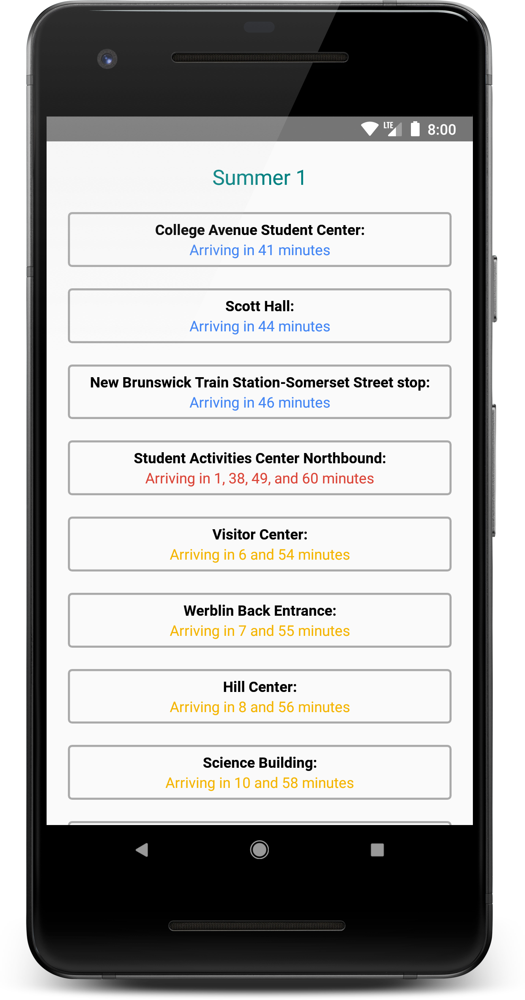
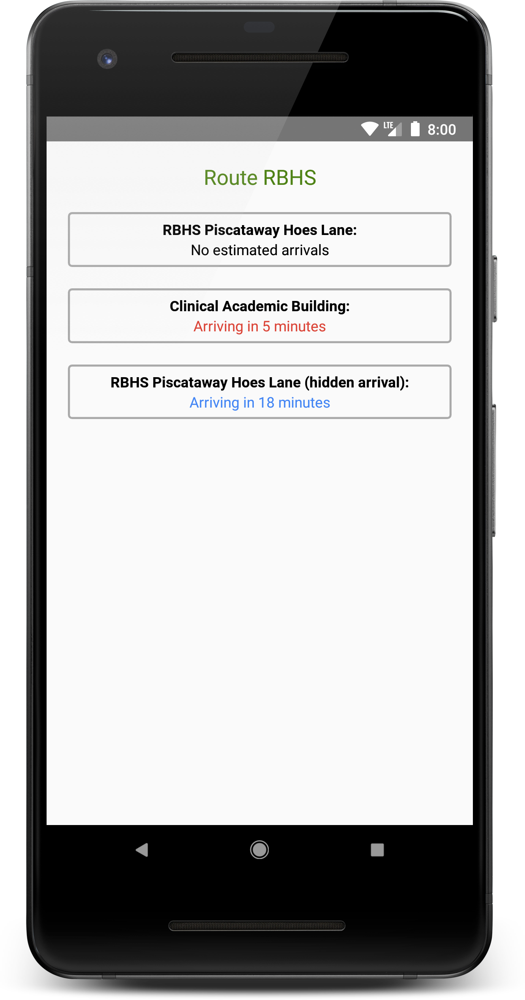

# Basic Bus Tracker (React Native edition)

Another Rutgers bus tracker, written to get a feel for app development in React Native.

Unlike [my first Rutgers bus tracker](https://github.com/mileskrell/basic-bus-tracker), this one displays **all** routes that have estimated arrival times. So it should continue to work year-round.

## Features

- Swipe to refresh
- For convenience, sorts weekend routes before others (such as the RBHS and New BrunsQuick routes)

## Screenshots

| Summer 1 | RBHS |
| - | - |
|  |  |
